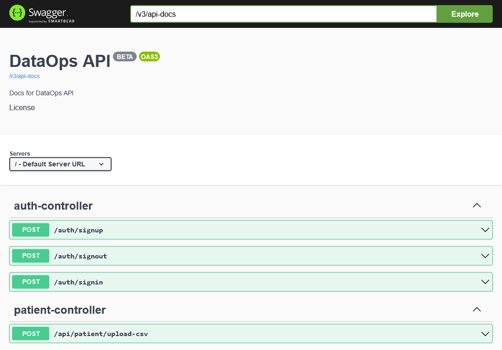
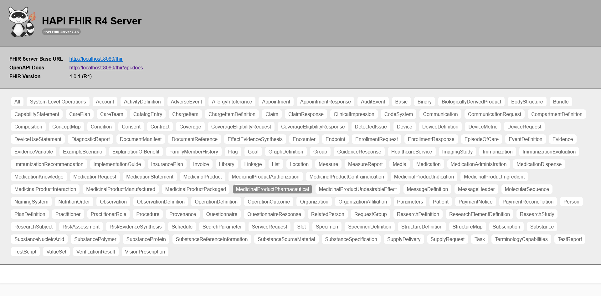
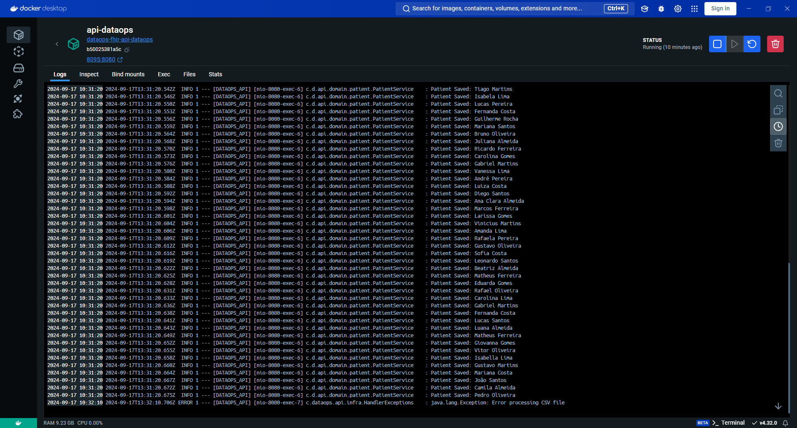
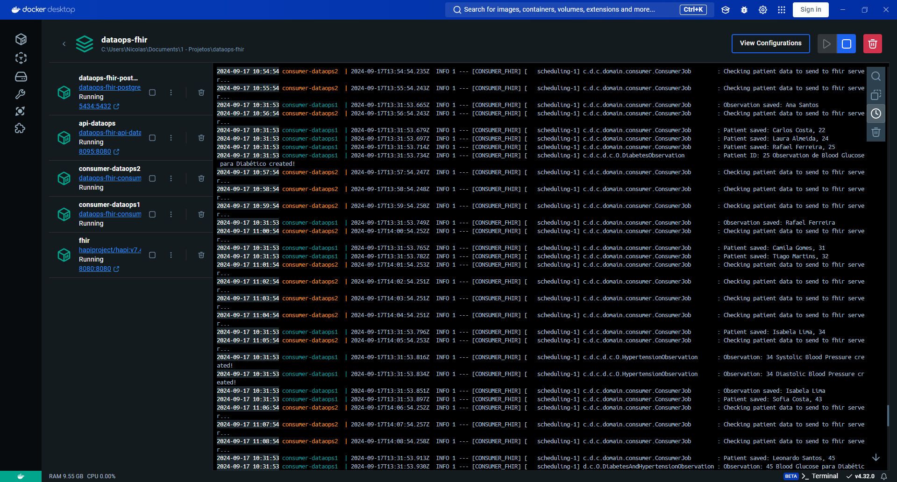
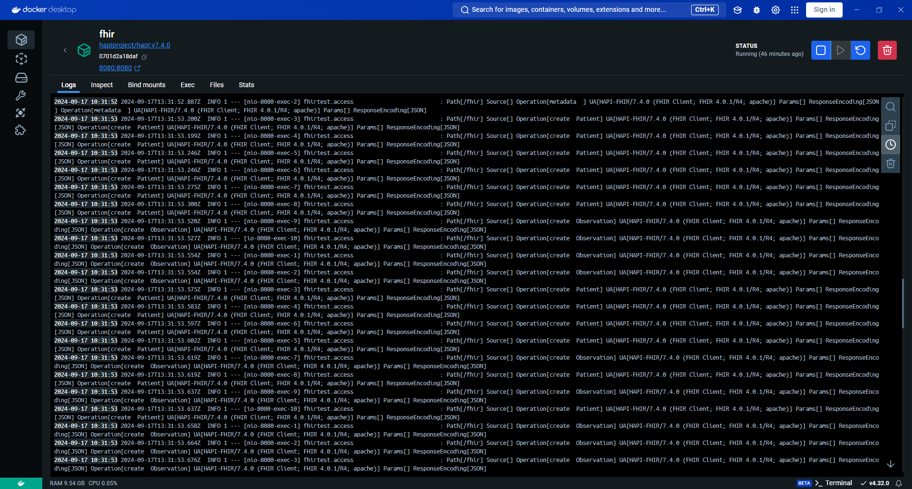
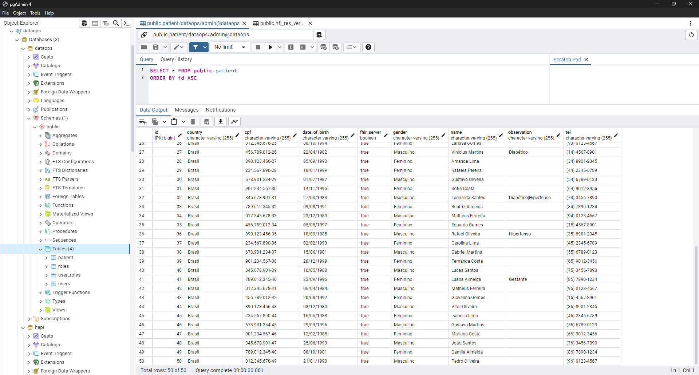
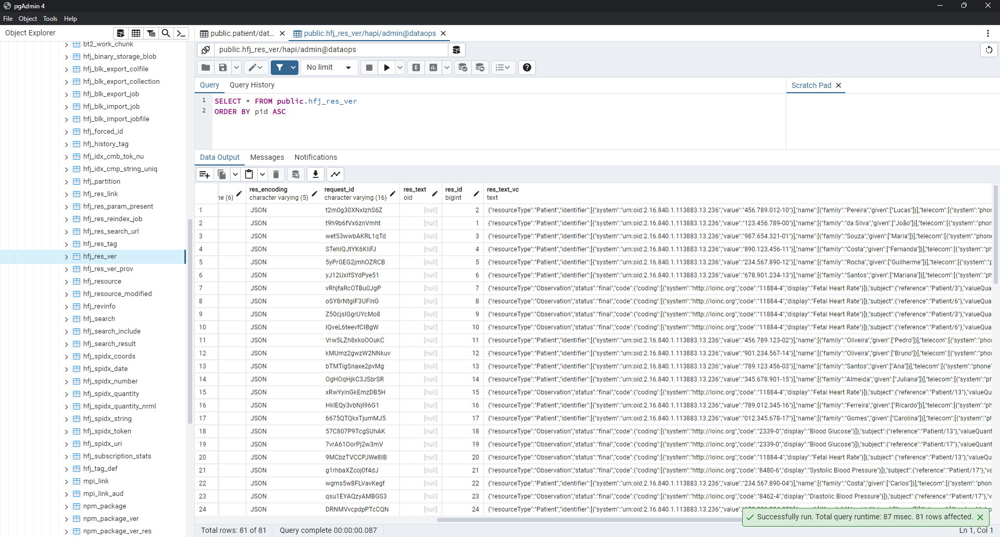

# DataOps FHIR SERVER

Este repositório contém serviços para operações de DataOps no contexto FHIR (Fast Healthcare Interoperability Resources) para a troca de dados entre os serviços.


## Stack utilizada

**API e Consumer:** Java, Spring Boot


## Funcionalidades

- Criação dos serviços: `fhir`, `postgres`, `consumer-dataops1`, `consumer-dataops2`, `api-dataops`

- api-datops:
    - endpoints de autenticação e autorização
    - endpoint de upload do csv e armazena os dados no banco `dataops`

- consumer-dataops:
    - job rodando a cada minuto para buscar dados dos pacientes com o atributo `fhir_server = false`, isso significa que os dados não foram enviados ainda ao servidor `FHIR`. Após o envio para o servidor `fhir`, o atributo atualiza para true;
    - o job roda de maneira assincrona e com tratamento para evitar race condition, utilizando skip lock e for update na consulta;
    - a consulta está trazendo 10 itens, porém, o serviço está rodando em um laço que só terminará quando não existir mais dados a ser processado, realizando novas buscas em 1 minuto.

- fhir: serviço open source, padrão Fast Healthcare Interoperability Resources é um conjunto de regras e especificações para troca de dados eletrônicos de saúde.
    - realizado a configuração para o serviço utilizar o banco de dados `POSTGRESQL` ao invés do padrão em memória `H2` no arquivo `hapi.application.yaml` configurado no arquivo do docker compose.
- postgres:
    - banco de dados utilizado em ambos os sitemas, possui script init-db para criação de varios banco de dados;
    - os bancos estão separados em:
      `service fhir: hapi` e `services consumer-dataops/api-datapos: dataops` .

## Variáveis de Ambiente

Para rodar esse projeto, você vai precisar adicionar as seguintes variáveis de ambiente no seu .env ou usará os valores default do `docker-compose-dev.yml`

`DB_URL`
`DB_USERNAME`
`DB_PASSWORD`
`POSTGRES_PASSWORD`
`POSTGRES_USER`
`POSTGRES_DB`
`POSTGRES_MULTIPLE_DATABASES`
`FHIR_SERVER`

## Rodando localmente

Clone o projeto

```bash
  git clone https://github.com/nickunger99/dataops-fhir
```

Entre no diretório do projeto

```bash
  cd dataops-fhir
```

Inicie o docker compose do projeto

```bash
  docker-compose -f docker-compose-dev.yml up -d --build
```

## Documentação da API

#### Registro de usuário

```http
  POST /auth/signup
```

| Parâmetro   | Tipo       | Descrição                           |
| :---------- | :--------- | :---------------------------------- |
| `username` | `string` | Nome de usuário para entrar no sistema |
| `email` | `string` | E-mail do usuário |
| `password` | `string` | Senha do usuário |
| `name` | `string` | Nome do usuário |

Registra um usuário com nivel `user`

#### Entrada de usuário

```http
  POST /auth/signin
```

| Parâmetro   | Tipo       | Descrição                           |
| :---------- | :--------- | :---------------------------------- |
| `username` | `string` | Nome de usuário  |
| `password` | `string` | Senha do usuário |

Caso encontre o usuário, retorna o token de acesso salvo nos cookies.

#### Saída de usuário

```http
  POST /auth/signout
```
Remove o token dos cookies de acesso ao sistema

#### Envio de CSV

```http
  POST /api/patient/upload-csv
```
| Parâmetro   | Tipo       | Descrição                           |
| :---------- | :--------- | :---------------------------------- |
| `csv` | `multipart/form-data` | Arquivo CSV para popular o banco de dados `dataops`|


Necessário ter entrado no sistema para realizar o upload do csv.
- O sistema realiza a leitura do csv na busca dos dados referenciados pelas colunas:
    - `Nome` `CPF` `Gênero` `Data de Nascimento` `Telefone` `País de Nascimento` `Observação`
- Salva os dados somente uma vez, verificando se existe o CPF cadastrado no sistema;
- Retorna mensagem de sucesso: code 201, {"message": "CSV processed and patients saved"}
- Retorna mensagem de erro: code 500, Error: java.lang.Exception: Error processing CSV file

## Screenshots










## Observação

- Certifique-se de que o banco de dados `hapi` e `dataops` foram criados corretamente, caso não criado pelo script, crie os bancos manualmente e suba novamente os serviços;
- Em caso de erro no momento de build dos serviços sobre o `mvnw`, altere a Conversão final de linha para o formato `UNIX`;
- Arquivo CSV está presente no caminho `data/patients.csv`.
